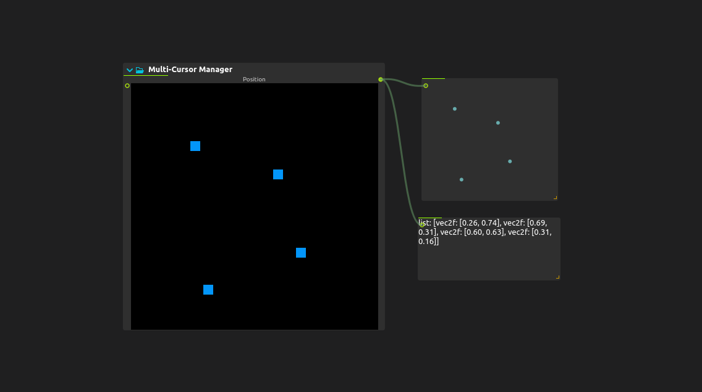
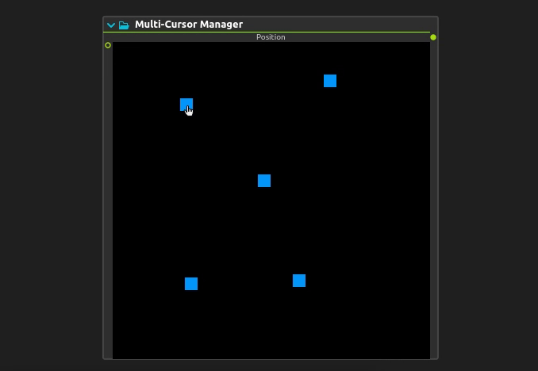
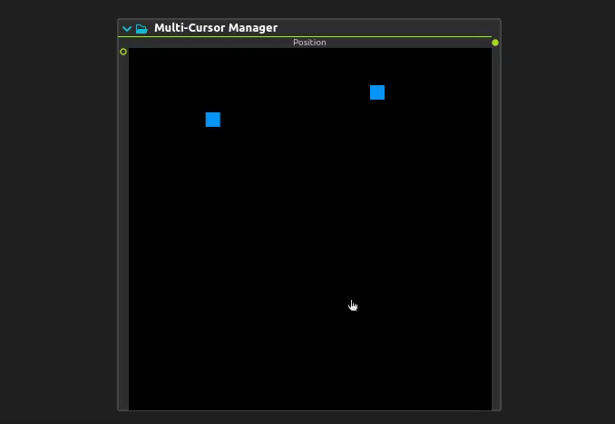
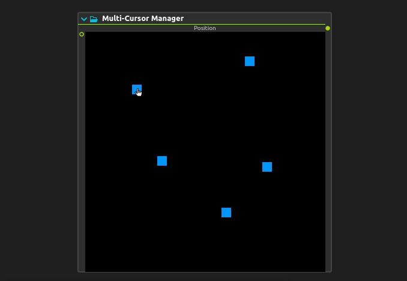

# Multi-Cursor Manager (X-Y point arrays)

The Multi-Cursor manager is a process for generating an array of XY points in 2D space by modifying their position, adding new ones and deleting others.

## Modifying points.

- Points can be dragged with the mouse.
  
  

- To create a new point, click on an empty space.
  
  

- To delete a point, right-click on it.
  
  
