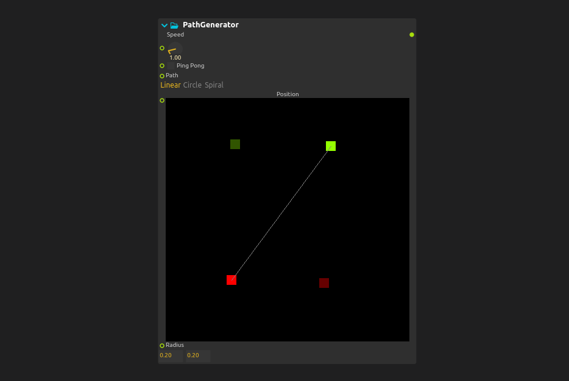
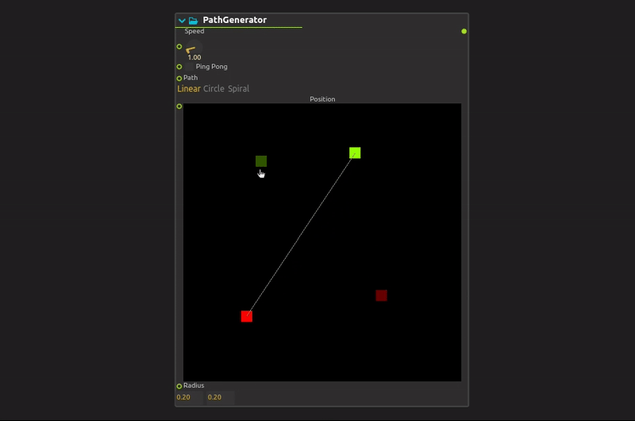
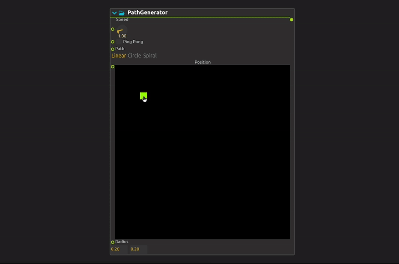
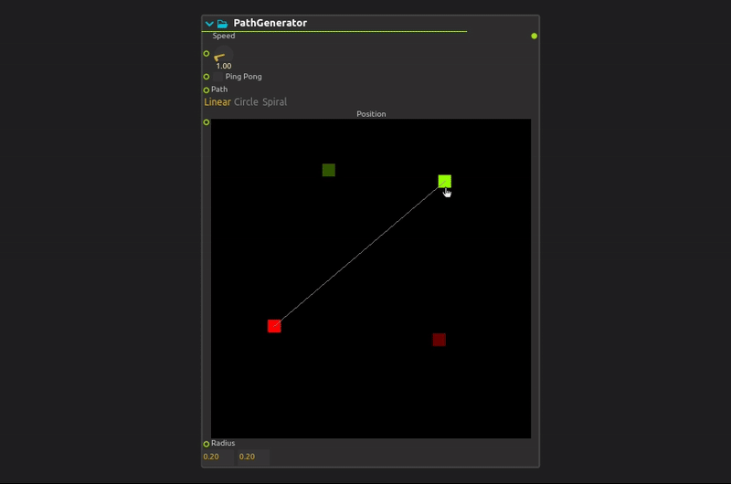
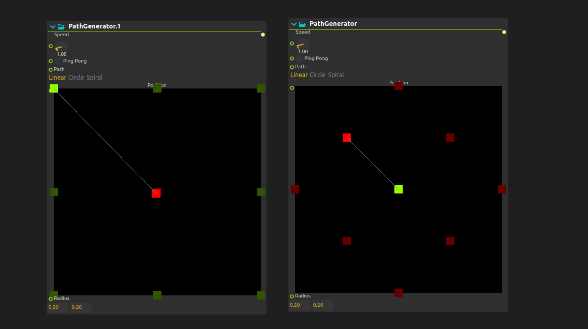
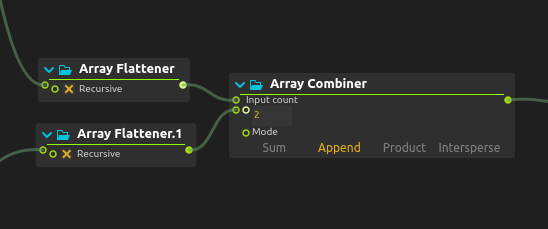
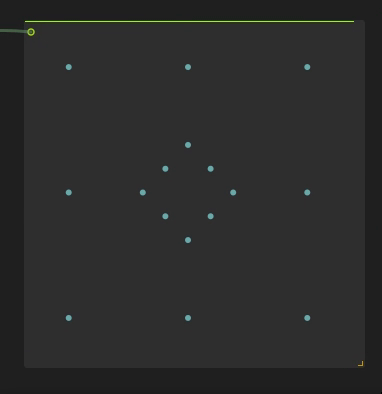

# Path Generator (X-Y automation)

The **Path Generator** is a process used to automate 2D X-Y positions over time by selecting predefined movement paths and manipulating cursors in the user interface.

Each **source** in the path generator has two cursors:

- The **green cursor** indicates the starting point.

- The **red cursor** indicates the end point of the movement.

## Modifying Points

You can customize a path by editing its control points directly in the interface:

- Points can be dragged with the mouse.
  
  

- To create a new point, click on an empty space.
  
  

- To delete a point, right-click on it.
  
  

## Parameters

- **Speed :** The speed of the movement can be modified by adjusting the speed parameter. Points move faster or slower depending on the parameter.  
  
  **NOTE :** Speed at 1 = movement takes 15 seconds to complete (one treatment cycle)

- **Ping Pong :** The PingPong option generates a continuous back-and-forth movement, avoiding a reset to the initial position. Instead of starting from the beginning, the animation naturally returns to the starting point.

- **Path :** Path selection is made in this parameter. For the moment, straight line, circle and spiral paths are available. The linear path allows you to move in a straight line between the start point (green) and the end point (red). The circle path allows circular movement around the center point (green), depending on the radius defined in another parameter.  The red cursor is useless in this case. The spiral path works in the same way as the circle, but generates a spiral movement.

- **Radius :** The Radius parameter defines the X and Y radii of the circle or spiral to be followed. For a spiral, it corresponds to the final radius. 
  
  **NOTE :** This parameter does not apply to the linear path.

## How to combine paths

To give you more creative freedom when creating movements, you can combine several movements together. In this short tutorial, we'll look at how to combine the following two movements.

Once you've created the various movements using the path generator, you can connect each of them to an array flattener, and then connect them to an array of Combinators. In input count, you must indicate the number of path generators you wish to combine. Then choose Append mode, so as not to modify the initial movements.

Result : 

